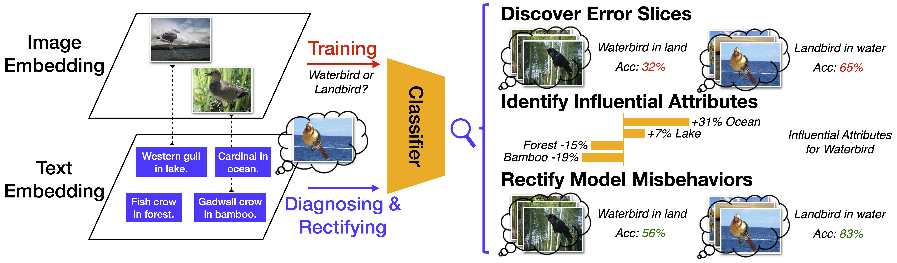

# Diagnosing and Rectifying Vision Models using Language


[](https://sites.google.com/view/drml)
[](https://lbesson.mit-license.org/)
[](https://www.python.org/downloads/release/python-3100/)
[](https://pytorch.org/get-started/previous-versions/#v112)
[](https://github.com/ambv/black)

This repo provides the PyTorch source code of our paper: 
[Diagnosing and Rectifying Vision Models using Language](https://openreview.net/forum?id=D-zfUK7BR6c) (ICLR 2023)

## Abstract

*Recent multi-modal contrastive learning models have demonstrated the ability to learn an embedding space suitable for building strong vision classifiers, by leveraging the rich information in large-scale image-caption datasets. Our work highlights a distinct advantage of this multi-modal embedding space: the ability to diagnose vision classifiers through natural language. The traditional process of diagnosing model behaviors in deployment settings involves labor-intensive data acquisition and annotation. Our proposed method can discover high-error data slices, identify influential attributes and further rectify undesirable model behaviors, without requiring any visual data. Through a combination of theoretical explanation and empirical verification, we present conditions under which classifiers trained on embeddings from one modality can be equivalently applied to embeddings from another modality. On a range of image datasets with known error slices, we demonstrate that our method can effectively identify the error slices and influential attributes, and can further use language to rectify failure modes of the classifier.*

## Approach


**Figure: Overview of our approach, DrML, that diagnoses and rectifies vision models using language.** Our approach leverages the shared image and text representation space learned by multi-modal contrastive learning. We find that classifiers trained on embeddings from one modality can be equivalently applied to embeddings from another modality, despite the fact that embeddings from these two modalities are distinctly separated. This cross-modal transferability phenomenon enables us to diagnose a vision model by training it on the image embedding space and probing it with text embeddings. The use of language allows us to generate a large set of diverse and novel inputs to discover error slices, identify influential attributes, and rectify model misbehaviors.

## Video


## Poster


## Citation
If you use this repo in your research, please cite it as follows:
```
@inproceedings{
  zhang2023diagnosing,
  title={Diagnosing and Rectifying Vision Models using Language},
  author={Zhang, Yuhui and HaoChen, Jeff Z and Huang, Shih-Cheng and Wang, Kuan-Chieh and Zou, James and Yeung, Serena},
  booktitle={International Conference on Learning Representations (ICLR)},
  year={2023},
  url={https://openreview.net/pdf?id=D-zfUK7BR6c}
}
```
